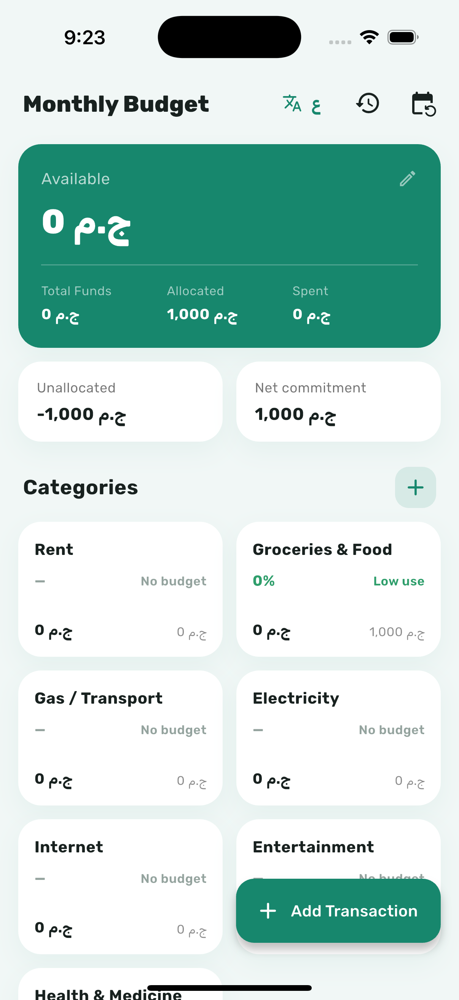

# 💰 Monthly Budget — متتبّع الميزانية الشهرية

A lightweight, **100% offline** personal budgeting app. Set a monthly balance, give each
category its own limit, log expenses, and watch your remaining money update in real time.
Fully **bilingual (English / العربية)** with proper RTL.

> ### Why I built this
> I built this in **about an hour** because I just wanted to manage my own money — nothing
> more. Every budgeting app I tried was *too big*: sign-ups, onboarding tours, cloud accounts,
> subscriptions, ads, and a hundred features I never touch. I wanted the opposite: open the
> app, see what I have left, add an expense, done. No login, no internet, no friction — one
> screen that just works. So I made it.

It started life as a spreadsheet I kept every month; this app is that spreadsheet turned into
something I actually enjoy opening on my phone.

---

## 📸 Screenshots

<table>
  <tr>
    <td align="center"><b>Dashboard</b></td>
    <td align="center"><b>Start a New Month</b></td>
  </tr>
  <tr>
    <td></td>
    <td></td>
  </tr>
</table>

The dashboard is the only screen: a balance summary up top, a category grid with live progress
bars in the middle, and recent transactions at the bottom — plus an insights panel that suggests
next month's budget from what you actually spent.

---

## ✨ Features

- **One screen, zero friction** — no auth, no onboarding, no setup wizard.
- **100% offline** — all data lives on-device (Hive). Works in airplane mode; nothing leaves your phone.
- **Set a balance + per-category budgets** — Rent, Groceries, Electricity, Internet… add your own anytime.
- **Real-time tracking** — available money, allocated, spent, unallocated and net commitment update instantly.
- **4-tier status flags** — every category is colored by how close it is to its limit:
  🟢 low use · 🟡 within rate · 🟠 near limit · 🔴 **over budget** (bold red alert).
- **Add via bottom sheets** — quick, keyboard-aware sheets for categories and transactions.
- **Insights & recommendations** — over-budget count, top spender, underused categories, and a
  **suggested budget for next month** per category, with one-tap "apply".
- **Start a New Month** — archives the finished month to browsable **history**, resets spent to 0,
  keeps your categories, and **rolls leftover money** into the next month's opening balance.
- **Bilingual + RTL** — smooth English ⇄ العربية toggle; the whole layout mirrors for Arabic.
- **Polished motion** — staggered fade/slide on load, animated progress bars, count-up feel,
  a pulse on over-budget categories.

---

## 🛠 Tech Stack

| Concern | Choice |
|---|---|
| Framework | Flutter |
| State management | [Riverpod](https://riverpod.dev) (`Notifier` + derived providers) |
| Local storage | [Hive CE](https://pub.dev/packages/hive_ce) — fast, lightweight, no SQL |
| Localization | `flutter_localizations` + `intl` (ARB, `gen-l10n`) |
| Animation | `flutter_animate` + built-in implicit animations |
| Typography | **Rubik** (Latin) + **Cairo** (Arabic), bundled for offline use |

**Palette:** primary `#17876D` · light background `#F1F7F6` · over-budget red `#E53935`.

---

## 🧱 Architecture

A pragmatic, layered structure — derived values mirror the original spreadsheet formulas:

```
lib/
├── core/            # theme (colors, Rubik), constants/thresholds, formatters
├── domain/          # pure budget logic: status tiers + next-month suggestions
├── data/            # Hive repository + plain-map models (no codegen)
├── application/     # Riverpod providers (settings, categories, transactions)
│                    #   + derived: category views, summary, analytics
└── presentation/    # splash · dashboard (+ section widgets) · history · sheets
```

Spend is **always derived** from transactions (never stored), so adding a category or
transaction can never corrupt existing totals.

---

## 🚀 Getting Started

```bash
flutter pub get
flutter gen-l10n          # generates the localization classes
flutter run               # on an emulator/simulator or a connected device
```

## ✅ Tests

```bash
flutter test
```

Covers the status-tier classifier, the next-month suggestion heuristic, the dashboard summary
math, and the Hive repository (transaction round-trip, month archive + rollover, category delete).

---

## 📦 Notes

- No backend, no API keys, no accounts — by design.
- Default currency is `ج.م` (EGP) and is editable.
- Fonts **Rubik** and **Cairo** are bundled under `assets/fonts/` under the
  [SIL Open Font License](assets/fonts/Rubik-OFL.txt).
